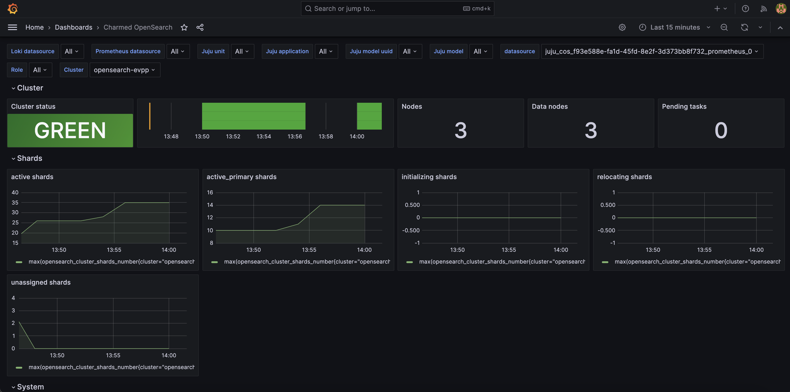
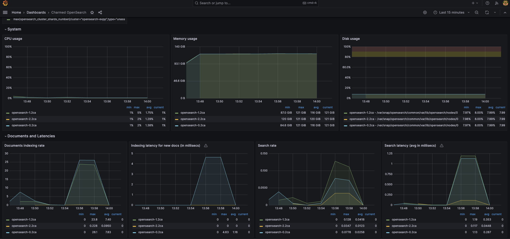

(how-to-monitoring-enable-cos)=
# How to enable monitoring (COS)

```{note}
All commands are written for juju >= v.`3.1.7`.
```

## Prerequisites

* A deployed [Charmed OpenSearch operator](tutorial-2-deploy-opensearch)
* A deployed [`cos-lite` bundle in a Kubernetes environment](https://charmhub.io/topics/canonical-observability-stack/tutorials/install-microk8s)

## Offer interfaces via the COS controller

First, we will switch to the COS K8s environment and offer COS interfaces to be cross-model
integrated with the Charmed OpenSearch model.

To switch to the Kubernetes controller for the COS model, run

```shell
juju switch <k8s_cos_controller>:<cos_model_name>
```

To offer the COS interfaces, run

```shell
juju offer grafana:grafana-dashboard
juju offer loki:logging
juju offer prometheus:receive-remote-write
```

## Consume offers via the OpenSearch model

Next, we will switch to the Charmed OpenSearch model, find offers, and consume them.

We are currently on the Kubernetes controller for the COS model.
To switch to the OpenSearch model, run

```shell
juju switch <db_controller>:<opensearch_model_name>
```

To consume offers to be reachable in the current model, run

```shell
juju consume <k8s_cos_controller>:admin/cos.grafana
juju consume <k8s_cos_controller>:admin/cos.loki
juju consume <k8s_cos_controller>:admin/cos.prometheus
```

## Deploy and integrate Grafana

First, deploy [grafana-agent](https://charmhub.io/grafana-agent):

```shell
juju deploy grafana-agent
```

Then, integrate (previously known as "[relate](https://documentation.ubuntu.com/juju/3.6/reference/relation/)")
it with Charmed OpenSearch:

```shell
juju integrate grafana-agent grafana
juju integrate grafana-agent loki
juju integrate grafana-agent prometheus
```

Finally, integrate `grafana-agent` with consumed COS offers:

```shell
juju integrate grafana-agent opensearch:grafana-dashboard
juju integrate grafana-agent opensearch:logging
juju integrate grafana-agent opensearch:cos-agent
```

After this is complete, Grafana will show the new dashboard `Charmed OpenSearch`
and will allow access to Charmed OpenSearch logs on Loki.

### Extend to Large Deployments

Large deployments run across multiple Juju applications.
Connect all the units of each application to grafana-agent, as explained above,
and the dashboard will be able to summarize the entire cluster.

### Connect Multiple Clusters

It is possible to have the same COS and dashboard for multiple deployments.
The dashboard provides selectors to filter which cluster to watch at the time.

## Connect to the Grafana web interface

To connect to the Grafana web interface, follow the
[Browse dashboards](https://charmhub.io/topics/canonical-observability-stack/tutorials/install-microk8s#heading--browse-dashboards)
section of the MicroK8s "Getting started" guide.

```shell
juju run grafana/leader get-admin-password --model <k8s_cos_controller>:<cos_model_name>
```

### Dashboard details

After accessing Grafana web interface, select the “Charmed OpenSearch” dashboard.

The dashboard filters for juju-specific elements, e.g. application name, unit, model;
and also OpenSearch’s cluster and roles.
The cluster dropdown lets you choose which cluster’s statistics to display.
You can also filter the view by selecting specific node roles, including nodes that span different models or applications.




